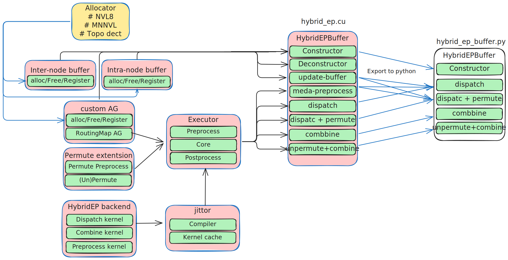
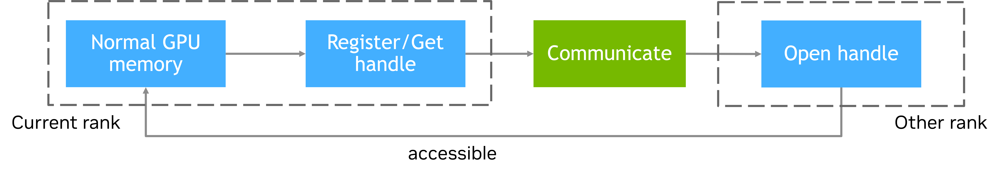
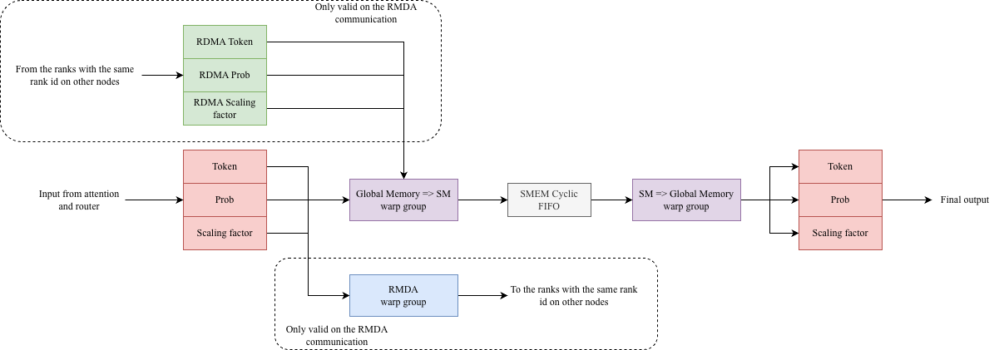
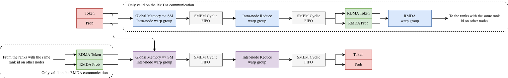

# Hybrid-EP Implementation Guide

## Table of Contents
1. [Overview](#1-overview)
2. [Interface](#2-interface)
3. [Config](#3-config)
4. [Buffer Management](#4-buffer-management)
5. [Executor](#5-executor)
6. [JIT Compiler](#6-jit-compiler)
7. [Extensions](#7-extensions)
8. [Hybrid-EP Kernels](#8-hybrid-ep-kernels)
9. [Allocator](#9-allocator)

---

## 1. Overview

### Architecture Diagram



### Code Structure
```
csrc/hybrid_ep/
├── hybrid_ep.*                    # Main HybridEPBuffer class
├── pybind_hybrid_ep.cu            # PyBind bindings
├── config.cuh                     # Config definitions
├── utils.cuh                      # Utility helpers and macros
├── allocator/                     # MNNVL/IPC memory allocator
├── backend/                       # Core dispatch/combine kernels
│   ├── hybrid_ep_backend.cuh      # Kernel implementations
│   ├── ibvcore.h                  # InfiniBand verbs definitions
│   └── topo_detection.cuh         # GPU topology detection
├── buffer/                        # Buffer coordinators
│   ├── intranode.*                # NVLCoordinator (intra-node communication)
│   └── internode.*                # RDMACoordinator (inter-node communication)
├── executor/                      # Kernel execution (dispatch/combine core)
├── extension/                     # Extensions (allgather, permute)
└── jit/                           # JIT kernel compiler
    
deep_ep/
├── hybrid_ep_buffer.py            # Python interface
└── buffer.py                      # Buffer management

tests/
├── test_hybrid_ep.py              # Functional tests
└── test_graphed_hybrid_ep.py      # CUDA Graph tests
```

---

## 2. Interface

### `__init__`

**Inputs:**
| Parameter | Type | Description |
|-----------|------|-------------|
| `group` | `torch.distributed.ProcessGroup` | PyTorch distributed process group |
| `hidden_dim` | `int` | Hidden dimension of tokens |
| `max_num_of_tokens_per_rank` | `int` | Maximum tokens per rank, used for buffer allocation|
| `num_local_experts` | `int` | Number of experts on each rank |
| `use_fp8` | `bool` | Use FP8 quantization (default: False) |
| `num_sms_dispatch_api` | `int` | SMs for dispatch kernel |
| `num_sms_combine_api` | `int` | SMs for combine kernel |
| `load_cached_kernels` | `bool` | Load pre-compiled JIT kernels (default: False) |
| `use_shared_buffer` | `bool` | Share intra-node buffer between dispatch/combine (default: True) |
| `enable_custom_allgather` | `bool` | Use optimized intra-node allgather (default: False) |

### `dispatch` / `dispatch_with_permute`

Dispatch tokens to target experts. Use `dispatch_with_permute` for integrated permutation (see [7.2 Permutation](#72-permutation)).

> **Routing Input Modes** (choose one):
> - **Index-based**: `topk_idx` + `topk_weights` + `num_of_experts`
> - **Map-based**: `routing_map` + `probs`

**Common Inputs:**
| Parameter | Type | Description |
|-----------|------|-------------|
| `hidden` | `Tensor[N, D]` | Input token embeddings |
| `topk_idx` | `Tensor[N, K]` | Top-K expert indices per token |
| `topk_weights` | `Tensor[N, K]` | Top-K routing weights |
| `num_of_experts` | `int` | Total number of experts |
| `routing_map` | `Tensor[N, E]` | Boolean routing map |
| `probs` | `Tensor[N, E]` | Routing probabilities |
| `scaling_factor` | `Tensor` | FP8 scaling factor |
| `handle` | `tuple` | Cached metadata from previous call |

**Additional Inputs for `dispatch_with_permute`:**
| Parameter | Type | Description |
|-----------|------|-------------|
| `num_of_experts_per_rank` | `int` | Experts per rank |
| `pad_multiple` | `int` | Pad output to multiple (for GEMM alignment) |
| `num_permuted_tokens` | `int` | Expected output size (for non_blocking) |
| `non_blocking` | `bool` | Skip sync, use GPU-side metadata (default: False) |

> **Non-blocking Mode:** When `non_blocking=True`, stream synchronizations are skipped. Output buffer is sized by `num_permuted_tokens`; overflow sets `overflow_flag=True` and drops excess tokens. In non-blocking mode, `num_dispatched_tokens_tensor` and `tokens_per_expert` are GPU tensors; otherwise they reside in CPU pinned memory.

**Outputs:**
| Return | `dispatch` | `dispatch_with_permute` |
|--------|------------|-------------------------|
| `dispatched_token` | Tokens for local experts | Permuted tokens grouped by expert |
| `dispatched_probs` | Routing probabilities | Routing probabilities |
| `dispatched_scaling_factor` | FP8 scaling factors | FP8 scaling factors |
| `tokens_per_expert` | - | `Tensor[E]`: Token count per expert |
| `handle` | For `combine` | For `combine_with_unpermute` |

### `combine` / `combine_with_unpermute`

Combine tokens from experts back to original positions. Use corresponding method based on dispatch variant.

**Inputs:**
| Parameter | Type | Description |
|-----------|------|-------------|
| `hidden` | `Tensor` | Expert output embeddings |
| `probs` | `Tensor` | Routing probabilities for weighted sum |
| `handle` | `tuple` | Metadata from dispatch (required) |
| `pad_multiple` | `int` | Padding alignment (`combine_with_unpermute` only) |

**Outputs:**
| Return | Type | Description |
|--------|------|-------------|
| `combined_token` | `Tensor[N, D]` | Combined tokens in original order |
| `combined_probs` | `Tensor` | Aggregated probabilities |

### `empty_jit_cache`

Clear all cached JIT-compiled kernels from disk.

### Handle Structure

The `handle` returned by dispatch methods contains precomputed metadata for the corresponding dispatch/combine call.

#### `dispatch` Handle

```python
handle = (
    sparse_to_dense_map,         # [0] Tensor
    rdma_to_attn_map,            # [1] Tensor
    attn_to_rdma_map,            # [2] Tensor
    num_dispatched_tokens_tensor,# [3] Tensor: Total dispatched token count
    local_expert_routing_map,    # [4] Tensor: Local expert routing information
    num_of_tokens,               # [5] int: Number of tokens per rank
    config,                      # [6] HybridEpConfigInstance: Runtime configuration
)
```

#### `dispatch_with_permute` Handle

```python
handle = (
    sparse_to_dense_map,         # [0] Tensor
    rdma_to_attn_map,            # [1] Tensor
    attn_to_rdma_map,            # [2] Tensor
    num_dispatched_tokens_tensor,# [3] Tensor: Total dispatched token count 
    local_expert_routing_map,    # [4] Tensor: Local expert routing information
    row_id_map,                  # [5] Tensor: Row permutation mapping for unpermute
    num_of_tokens_per_rank,      # [6] int: Number of tokens per rank
    config,                      # [7] HybridEpConfigInstance: Runtime configuration
    overflow_flag,               # [8] Tensor: Buffer overflow indicator
)
```

---

## 3. Config

Hybrid-EP uses two configuration structures defined in [`config.cuh`](../csrc/hybrid_ep/config.cuh):

- **`BufferConfig`**: A subset of parameters used solely for buffer size calculation, stored persistently in the buffer object.
- **`HybridEpConfigInstance`**: Contains all parameters needed for JIT-compiling and launching Hybrid-EP kernels. A new instance is created for each invocation.

Each run compares the new `HybridEpConfigInstance` against `BufferConfig` to detect whether existing buffers are sufficient. If not, a free-reallocate cycle is triggered (see [4. Buffer Management](#4-buffer-management)).

### Parameter Reference

#### Runtime Parameters

These parameters are typically derived from the model configuration:

| Parameter | Description |
|-----------|-------------|
| `hidden_dim` | Hidden size (must match model hidden dimension) |
| `max_num_of_tokens_per_rank` | Maximum sequence length for dispatch kernel input |
| `num_of_experts_per_rank` | Number of experts hosted by each rank |
| `num_of_nodes` | Number of NVLink domains (not OS nodes/containers) |
| `num_of_ranks_per_node` | Number of ranks within one NVLink domain |

#### Performance Tuning Parameters

These parameters are pre-tuned for optimal performance. Adjustments are generally not recommended, but can be made via environment variables for specific hardware configurations:

| Parameter | Env Variable | Description |
|-----------|--------------|-------------|
| `num_of_threads_per_block_preprocessing_api` | `NUM_OF_THREADS_PER_BLOCK_PREPROCESSING_API` | Thread-block width for preprocessing kernel |
| `num_of_blocks_preprocessing_api` | - | Grid size for preprocessing kernel |
| `num_of_stages_dispatch_api` | `NUM_OF_STAGES_DISPATCH_API` | Pipeline depth for dispatch. Larger improves occupancy but increases shared memory usage. Reduce if `hidden_dim` is very large |
| `num_of_blocks_dispatch_api` | - | Number of CTAs for dispatch; controls SM utilization |
| `num_of_stages_g2s_combine_api` | `NUM_OF_STAGES_G2S_COMBINE_API` | Pipeline depth for global-to-shared in combine. Same shared memory trade-off as dispatch |
| `num_of_stages_s2g_combine_api` | `NUM_OF_STAGES_S2G_COMBINE_API` | Pipeline depth for shared-to-global in combine |
| `num_of_blocks_combine_api` | - | Number of CTAs for combine kernels |

### Note on `max_num_of_tokens_per_rank`

During JIT compilation, `max_num_of_tokens_per_rank` serves as a template parameter for static resource allocation. At runtime, the actual `num_of_tokens_per_rank` is passed and must satisfy:

```
num_of_tokens_per_rank <= max_num_of_tokens_per_rank
```

Since `max_num_of_tokens_per_rank` also determines buffer allocation size, Hybrid-EP automatically updates this value on each run to ensure sufficient capacity

---

## 4. Buffer Management

Hybrid-EP uses two types of coordinators to manage communication buffers:
- **NVLCoordinator**: Manages intra-node communication buffers
- **RDMACoordinator**: Manages inter-node communication buffers

### 4.1 Buffer Types

Hybrid-EP uses two categories of GPU memory:

- **Registered Buffer**: GPU memory registered for cross-rank access. For inter-node, memory is registered with RDMA; for intra-node, a CUDA IPC handle is exported.
- **Normal Buffer**: Standard `cudaMalloc` memory for local computation, not accessible by other ranks.

**GPU-NIC Mapping for RDMA**

For RDMA scenarios, buffer registration requires establishing a GPU-NIC mapping to specify which network interface each GPU uses for communication. The backend supports automatic topology discovery by default. If manual configuration is needed, the following environment variables can be used:

| Environment Variable | Description |
|---------------------|-------------|
| `HYBRID_EP_ENABLE_MANUAL_NIC_MAPPING` | Set to `1` to enable manual NIC mapping; otherwise, automatic topology discovery is used |
| `HYBRID_EP_NIC_MAPPING` | GPU-to-NIC mapping string in the format `<gpu_id>:<nic_name>,...` |

### 4.2 Buffer Allocation

Hybrid-EP uses a **worst-case preallocation strategy** to handle dynamic token routing. The maximum token count assumes all tokens could be routed to a single expert:

```
max_num_of_tokens = max_num_of_tokens_per_rank × num_of_ranks_per_node × num_of_nodes
```

**Intra-node buffers** (per rank):
- `token_buffer`: `max_tokens × hidden_dim × sizeof(dtype)`
- `prob_buffer`: `max_tokens × (num_of_experts_per_rank × num_of_ranks_per_node) × sizeof(float)`
- `scaling_factor_buffer`: `max_tokens × (hidden_dim / 128) × sizeof(float)` — FP8 only

**Inter-node RDMA buffers** (when `num_of_nodes > 1`, per rank):
- `rdma_token_buffer`: `max_tokens_per_rank × (num_nodes - 1) × hidden_dim × sizeof(dtype)`
- `rdma_prob_buffer`: `max_tokens_per_rank × (num_nodes - 1) × (num_of_experts_per_rank × num_of_ranks_per_node) × sizeof(float)`

Per RDMA buffer footprint is capped at ≤1 GB.

**Example (EP64, 256 experts, BF16, hidden_dim=7168, 4096 tokens/rank):**

| Scenario | Buffer | Calculation | Size |
|----------|--------|-------------|------|
| **MNNVL** (64 ranks × 1 node) | max_tokens | 4096 × 64 × 1 | 262,144 |
| | Intra-node token | 262,144 × 7168 × 2B | ~3.5 GB |
| | Intra-node prob | 262,144 × 256 × 4B | ~256 MB |
| | **Total per rank** | | **~3.75 GB** |
| **RDMA** (8 ranks × 8 nodes) | max_tokens | 4096 × 8 × 8 | 262,144 |
| | Intra-node token | 262,144 × 7168 × 2B | ~3.5 GB |
| | Intra-node prob | 262,144 × 32 × 4B | ~32 MB |
| | RDMA token | 4096 × 7 × 7168 × 2B | ~392 MB |
| | RDMA prob | 4096 × 7 × 32 × 4B | ~3.5 MB |
| | **Total per rank** | | **~4 GB** |

Because this buffer is globally unique per rank, overall GPU memory usage remains controllable.

### 4.3 Shared Buffer

By default (`use_shared_buffer=True`), dispatch and combine share the same buffer since they execute sequentially. This halves memory usage but means concurrent Hybrid-EP operations sharing the same buffer cannot overlap.

> **Important:** Because the buffer is global, any two Hybrid-EP communication operations that share the same buffer **cannot overlap**.

### 4.4 Buffer Registration Workflow

Buffer allocation and registration are time-consuming operations, so they are performed only during initialization. The workflow is:

1. **Allocate**: Each rank allocates local buffers using `ExtendedMemoryAllocator`
2. **Get Handle**: Create IPC-exportable handles for registered buffers
3. **Exchange**: Use `torch.distributed.all_gather` to exchange handles across ranks
4. **Open Handle**: Each rank opens handles from other ranks to obtain remote buffer addresses



### 4.5 Dynamic Buffer Update

`BufferConfig` is a subset of `HybridEpConfigInstance`. Each run compares them to check if reallocation is needed:

```
RuntimeHybridEpConfigInstance ──compare──► StaticBufferConfig
              │                                   │
              └─ need larger? ─── No ────────────►│ Use existing
                              └── Yes ──► release ──► update ──► allocate ──► exchange
```

> **Warning:** Buffer reallocation is slow due to memory registration and handle exchange. Pre-allocate sufficient capacity via `max_num_of_tokens_per_rank` to avoid runtime reallocation.

---

## 5. Executor

The Executor orchestrates all communication operations. Each API is divided into three stages: **preprocess**, **core**, and **postprocess**.

| API | Preprocess | Core | Postprocess |
|-----|------------|------|-------------|
| `metadata_preprocess` | - | Allgather + metadata kernel | - |
| `dispatch` | D2D to RDMA buffer* | Dispatch kernel | D2D from buffer |
| `dispatch_with_permute` (no handle) | D2D to RDMA buffer* + permute preprocessing | Dispatch kernel | Permute kernel |
| `dispatch_with_permute` (with handle) | D2D to RDMA buffer* | Dispatch kernel | Permute kernel |
| `combine` | D2D to buffer | Combine kernel | - |
| `combine_with_unpermute` | Unpermute kernel | Combine kernel | - |

\* Only when `num_of_nodes > 1`

---

## 6. JIT Compiler

Hybrid-EP uses NVCC JIT compilation to generate optimized kernels based on runtime configuration.

### 6.1 JIT Workflow

1. **Code Generation**: Generate kernel source code from `HybridEpConfigInstance` template parameters
2. **Compile**: Execute `nvcc` via command line to compile the `.cu` source to a `.so` shared library
3. **Load**: Open the compiled `.so` with `dlopen` and resolve function symbols via `dlsym`
4. **Cache**: Store the function pointer in `KernelCache` for subsequent calls

```
HybridEpConfigInstance ──► Generate .cu ──► nvcc compile ──► .so ──► dlopen/dlsym ──► function pointer
```

### 6.2 Cache Management

All ranks compile identical kernels, but use unique filenames (including `node_rank`, `local_rank`, and timestamp) to avoid conflicts. After compilation, `std::filesystem::rename` atomically merges them into a single cached `.so`.

**Cache Directory:**
- Environment variable: `HYBRID_EP_CACHE_DIR`
- Default: `$HOME/.deepep/hybrid_ep/jit` (fallback: `/tmp/.deepep/hybrid_ep/jit`)

**Reusing Cache:**
Set `load_cached_kernels=True` in `HybridEPBuffer.__init__()` to load pre-compiled kernels from the cache directory, avoiding recompilation overhead.

---

## 7. Extensions

### 7.1 Allgather

> **Experimental Feature**

Custom allgather implementation that replaces NCCL's allgather for routing map collection. This avoids the overhead of copying from NCCL's internal buffer to PyTorch tensors. Enable via `enable_custom_allgather=True` in initialization.

### 7.2 Permutation

Since dispatch output and combine input reside in registered buffers (see [4. Buffer Management](#4-buffer-management)), they cannot be managed by PyTorch's caching allocator. This normally requires an extra D2D copy to move results into standard PyTorch tensors—which is exactly what `dispatch` does.

`dispatch_with_permute` integrates permutation with this data movement: it permutes tokens by expert while simultaneously copying to PyTorch-managed memory, making the output directly usable by expert kernels.

Conversely, `combine_with_unpermute` reverses this process: it unpermutes expert outputs back to original token order while copying from PyTorch tensors to registered buffers before the combine operation.

Additionally, some training frameworks require token alignment per expert (e.g., for efficient GEMM). The `pad_multiple` parameter enables padding to meet these alignment requirements.

#### Buffer Allocation Challenge

When using `dispatch_with_permute` / `combine_with_unpermute`, we face a fundamental challenge: **the number of permuted tokens is unknown before preprocessing completes** due to the dynamic nature of MoE routing.

Allocating buffers for the worst case would require `worst_case_dispatch_output × min(topk, num_experts_per_rank)` tokens—an unacceptable memory overhead. Additionally, the permuted output serves as expert input (activation memory) and cannot be globally reused. Furthermore, integrating permutation into Hybrid-EP **eliminates the opportunity for recomputing permutation** during backward pass.

#### Default Mode (Blocking)

By default, `dispatch_with_permute` performs a **stream synchronization** after the preprocessing kernel to obtain the exact token count, then allocates a precisely-sized buffer using `torch.empty()`:

```
┌───────────────────┐     ┌──────────────┐     ┌─────────────────┐     ┌─────────────────┐     ┌────────────────┐
│ Permute           │────▶│ Stream Sync  │────▶│ Allocate Buffer │────▶│ Dispatch Kernel │────▶│ Permute Kernel │
│ Preprocessing     │     │ (blocking)   │     │ (exact size)    │     │                 │     │                │
└───────────────────┘     └──────────────┘     └─────────────────┘     └─────────────────┘     └────────────────┘
```

#### Non-Blocking Mode

For CUDA graph capture, `non_blocking=True` allows users to provide an estimated token count (`num_permuted_tokens`) to avoid synchronization:

```
┌───────────────────┐     ┌─────────────────────┐     ┌─────────────────┐     ┌────────────────┐
│ Permute           │────▶│ Allocate Buffer     │────▶│ Dispatch Kernel │────▶│ Permute Kernel │
│ Preprocessing     │     │ (user-estimated)    │     │                 │     │                │
└───────────────────┘     └─────────────────────┘     └─────────────────┘     └────────────────┘
```

**Output behavior**:
- **Overflow** (actual > estimated): Excess tokens are dropped, `overflow_flag = True`
- **Underflow** (actual ≤ estimated): Trailing portion contains garbage data, use `tokens_per_expert` to find valid ranges

---

## 8. Hybrid-EP Kernels

The dispatch and combine kernels in Hybrid-EP are **warp-specialized persistent kernels**:

- **Persistent**: Each CUDA block exclusively occupies one SM for its entire lifetime
- **Warp-specialized**: Different warp groups within a block form a pipelined dataflow
- **Independent blocks**: Data is divided into chunks evenly distributed across blocks

**Data type support:**
- Dispatch kernel supports BF16 and FP8. For FP8, scaling factors are transmitted alongside tokens (one 32-bit scaling factor(4 uint8 or 1 fp32) per 128 elements)
- Combine kernel only supports BF16

**RDMA communication pattern:**
We define GPUs with the same local rank across different nodes as *peers* (e.g., GPU 0 on node A peers with GPU 0 on node B). Similar to DeepEP, Hybrid-EP first performs IB communication between peer GPUs, then each rank distributes the received inter-node data locally. This overlaps IB communication with intra-node NVLink operations to hide latency.

### 8.1 Dispatch Kernel



The dispatch kernel moves tokens from attention output to expert input buffers:

1. **G2S Warp Group**: Loads tokens/probs/scaling_factors from global memory to shared memory
2. **SMEM Cyclic FIFO**: Staging buffer between pipeline stages
3. **S2G Warp Group**: Writes data to remote ranks' buffers via NVLink
4. **RDMA Warp Group** (multi-node only): Sends data to corresponding ranks on other nodes; also receives RDMA data from other nodes

### 8.2 Combine Kernel



The combine kernel aggregates expert outputs back to original token positions.

1. **G2S Warp Group**: Loads tokens/probs/scaling_factors from global memory to shared memory
   - *Inter-node*: Loads data for local distribution
   - *Intra-node* (multi-node only): Loads data to be sent to peers
2. **SMEM Cyclic FIFO**: Staging buffer between pipeline stages
3. **Reduce Warp Group**: Reduces data from different ranks
   - *Inter-node*: Reduces data received from all ranks
   - *Intra-node* (multi-node only): Pre-reduces data within node before sending to peers
4. **S2G Warp Group**: Writes data to buffers
   - *Inter-node*: Writes to intra-node peers' buffers via NVLink
   - *Intra-node* (multi-node only): Writes to RDMA buffer for cross-node transfer
5. **RDMA Warp Group** (multi-node only): Sends data to peer ranks on other nodes; also receives RDMA data from peers

## 9. Allocator

### 9.1 Memory Allocation

The allocator provides cross-rank accessible memory with these operations: `allocate`, `free`, `get_handle`, `open_handle`, `close_handle`.

- **Fabric mode**: Uses `cuMemCreate`/`cuMemMap` and `cuMemExportToShareableHandle` for MNNVL systems
- **IPC mode**: Uses `cudaMalloc` and `cudaIpcGetMemHandle` for standard multi-GPU systems

### 9.2 Topology Detection

The allocator detects which ranks share the same NVLink domain via `detect_accessible_ranks()`, which exchanges test memory handles and checks accessibility.

To override automatic detection, set:

```bash
export NUM_OF_HYBRID_EP_RANKS_PER_NVLINK_DOMAIN=8
```

This environment variable specifies the number of ranks that can directly access each other's GPU memory within a single NVLink domain. It determines:
- `local_rank = rank % NUM_OF_HYBRID_EP_RANKS_PER_NVLINK_DOMAIN` — rank index within the NVLink domain
- `node_rank = rank // NUM_OF_HYBRID_EP_RANKS_PER_NVLINK_DOMAIN` — which NVLink domain this rank belongs to
- `num_of_nodes = group_size // NUM_OF_HYBRID_EP_RANKS_PER_NVLINK_DOMAIN` — total number of NVLink domains

The value must evenly divide the total number of ranks.